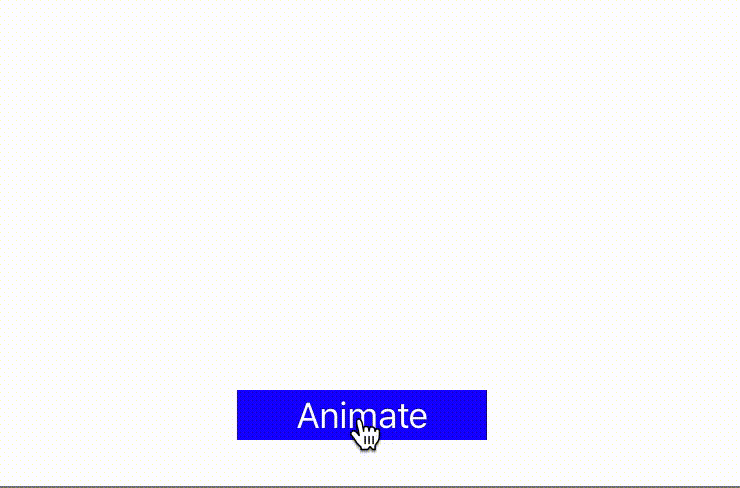

# SwiftAnimations

### Description
SwiftAnimations it's library created to visualize changes to array. It might be a helpful tool for studying  sorting algorithms. 

The source code contains example of using the library with bubble sort. 
#### Usage
Library comes with several handy methods for visualizing changes:
``` 
swapElements // Responsible for swapping elements in array
selectElements // Selecting and deselecting
insertAtIndex moves element from index a to b and shifts array 
up, down, rightLeft, for more granular control over animations
```
Each of the methods creates and adds an animation to the list of animations. 



Here is original Bubble Sort code copied from awesome Swift Algorithms Club: https://github.com/raywenderlich/swift-algorithm-club

```

func originalBubbleSort(_  array:inout [Int]){
    for _ in 0..<array.count {
        for j in 1..<array.count {
            if array[j] < array[j-1] {
                let tmp = array[j-1]
                array[j-1] = array[j]
                array[j] = tmp
            }
        }
    }
}
```
In order to use library you have to:
1. Create an instance of the library
```
    let visualizer:ArrayAnimationView<Int> = ArrayAnimationView(frame: CGRect(x: 0, y: 0, width: 380, height: 50))
```
2. Add it to the view
``` 
    self.view.addSubview(visualizer) 
```
3. Display array  

```
    var a = [3,2,0,8,5,10,6,9]
    visualizer.displayArray(a)
```

4. Create an extension with animation:
The key point here is recognize what algorithm is doing, and visualize it. For example the code below:
```
   let tmp = array[j-1]
    array[j-1] = array[j]
    array[j] = tmp
```
is performing swap of two elements of the array. The code below is a full example of animations 

5. Animate changes
    visualizer.resetAnimations()
    visualizer.bubbleSort(&a)
    visualizer.animateChanges()
    


```
extension  ArrayAnimationView{
    func bubbleSort(_  array:inout [Int]){
        for _ in 0..<array.count {
            for j in 1..<array.count {
                //Compare two elements: so slide down
                if array[j] < array[j-1] {
                    let tmp = array[j-1]
                    array[j-1] = array[j]
                    array[j] = tmp
                    swapElements(arrayElements[j], arrayElements[j-1], j, j-1)
                }
                else{

                selectElements([arrayElements[j], arrayElements[j-1]], [true,true])
                down([arrayElements[j], arrayElements[j-1]])
                up([arrayElements[j], arrayElements[j-1]])

                selectElements([arrayElements[j], arrayElements[j-1]], [false,false])
                    
                }
            }
        }
    }
}
``

